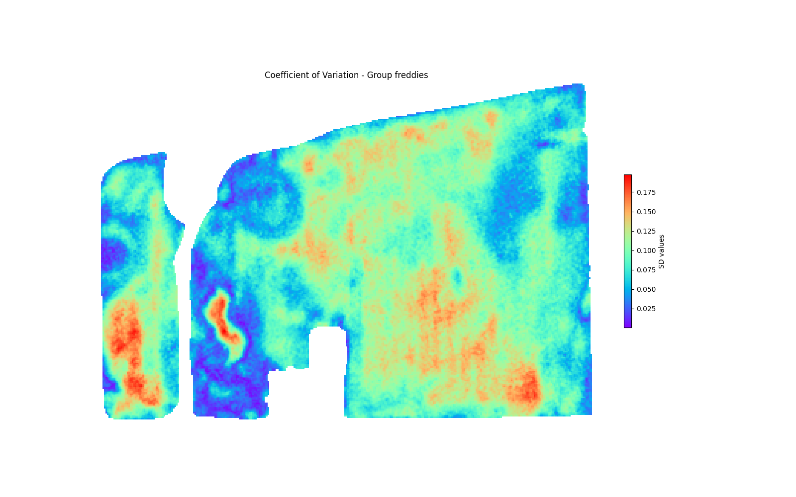
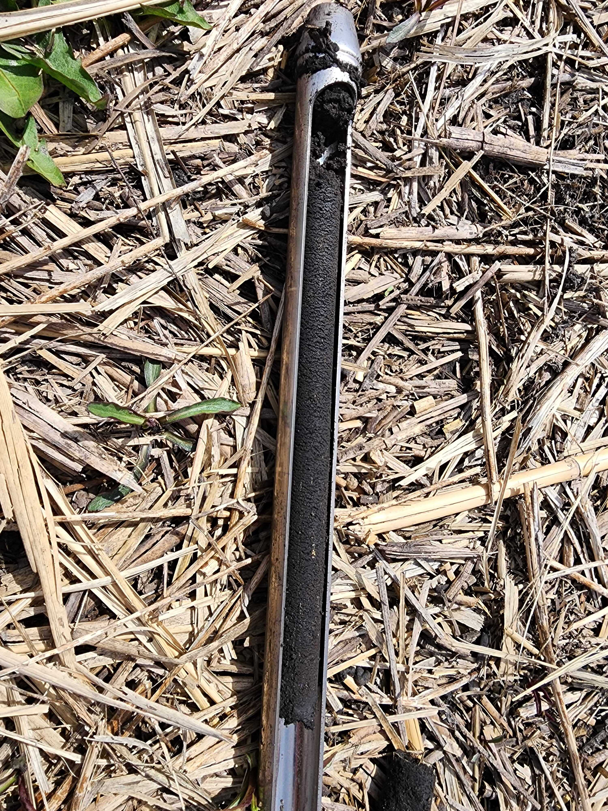

# SpatioTemporal-Lodging-
This is the coding implementation for the collaborative project in the transition from use of traditional approaches into modern data science approaches involves agroecosystem modelers in CABBI. 

This project aims to automatize the identication of optimal sample locations for monitoring below-above resource allocation in plants in farm fields, with the end goal of improving agroecosystem models parametrization and long-term indicators of sustainability in these systems

1) [Sign up for GEE at: ](https://signup.earthengine.google.com/.)
```
  conda create --name lodging python=3.9  

  cd lodging

  conda activate lodging
  
  pip install earthengine-api

  earthengine authenticate

  conda install --file requirements.txt
```
  
  geopandas==0.14.1
  shapely==2.0.2
  pyproj==3.6.1
  pandas==2.1.3
  gdown==4.7.1 
  

2) GEE downloader py file (will download bounding box of satellites using the shps of farm fields)
```
  python ee_downloader.py /input_folder /outputfolder (Gdrive)
```
  Uses is interactivelly asked for calendar date ranges, +1 can be added

  once images are downloaded to Gdrive, user is asked if want to download them to local folder

3) Reproject all files to common proj system
  ```
  python reproject.py 
```
  reproject all tif and shps to same coord system for further analysis

3) Masking satellite tifs to shp of farm fields
```
  python masking.py 
```
4) Multi-year analysis including intra-year accumulated NDRE and SD between years
  ```
  python multi_year_analysis.py 
  ```
5) Temporal profile using (Intra-year clustering layer)
```
  python clustering.py
```
Pipeline of the implemented solution using GEE API calls and Python scripting
<div align="center"">
    
</div>


<p>

Farm field example case of inter-year standard desviation calculation using 4 years of intra-year accumulated NDRE.

</p>

<div align="center"">
    
</div>

<p>

Example soil core extraction at defined locations per cluster zones using the proposed pipeline.

</p>

<div align="center"">
    
</div>

